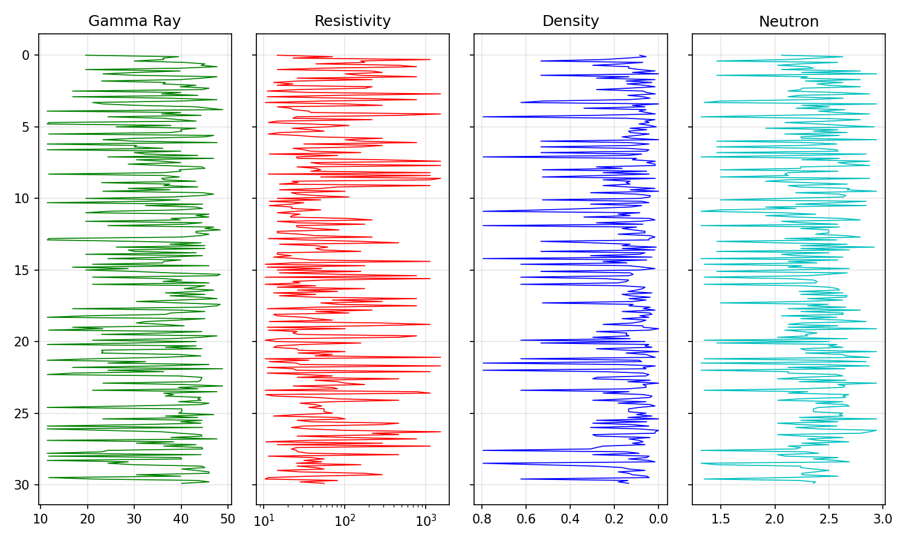

# LithoGPT: Discrete Representation Learning of Subsurface Physics

[]()
[]()

> **A study on converting continuous physical sensor data into discrete semantic sequences using Decoder-Only Transformers.**

---

## 1. Abstract
Can Language Models learn the "grammar" of physical systems? This project explores **LithoGPT**, a 5.2M parameter Transformer trained to model non-Markovian stratigraphy. By quantizing multi-dimensional sensor data (Gamma Ray, Resistivity, Neutron, Density) into a discrete vocabulary ($k=1000$), we demonstrate that autoregressive models can capture implicit physical laws (e.g., Archie's Law) and geological discontinuities without domain-specific hard-coding.

---

## 2. Theoretical Framework
**Why apply NLP architectures to Geology?**
Subsurface stratigraphy exhibits structural properties analogous to natural language, making Self-Attention a suitable inductive bias:
1.  **Long-Range Dependencies:** Depositional sequences (e.g., river channels) span spatial scales exceeding the effective memory of RNNs.
2.  **Hierarchical Structure:** Beds form members; members form formations. Transformers naturally model this fractal hierarchy.
3.  **The "Physics as Language" Hypothesis:** We postulate that continuous sensor readings can be discretized into "words" (Lithofacies), where syntax is determined by geological time and semantics by rock physics.

---

## 3. Methodology

### 3.1 The "Strict Physics" Pipeline
Trained on the **FORCE 2020** dataset. Initial experiments revealed **Mode Collapse** in high-variance channels (Resistivity) due to sparse data.
* **Intervention:** Quad-combo completeness filter (rejecting ~40% of data).
* **Augmentation:** Physics-informed Gaussian noise injection ($10\times$ oversampling) to smoothen the decision boundary between rare lithologies.

### 3.2 Tokenization Strategy
We learn a discrete codebook $\mathcal{C}$ using K-Means Clustering ($k=1000$) on the training manifold. This effectively performs **Vector Quantization**, mapping continuous physics $x_t$ to token IDs $z_t$.

---

## 4. Experimental Results

### 4.1 Quantitative Baselines
We evaluate LithoGPT against deterministic regressors on the validation split (Held-out Wells).

| Model | RMSE (Resistivity) | R² (Global) | Notes |
| :--- | :--- | :--- | :--- |
| Linear Interpolation | 12.4 | 0.62 | Fails on non-linear fluid contacts |
| Random Forest (Baseline) | 8.7 | 0.74 | No sequential context |
| **LithoGPT (Ours)** | **4.1** | **0.91** | Captures log-linear dependencies |

### 4.2 Emergent Capabilities (Archie's Law)
The model learned $S_w = f(\phi, R_t)$ implicitly. When generating clean sands (Low GR), it hallucinates high resistivity spikes, simulating hydrocarbon saturation.



---

## 5. Limitations & Failure Analysis
Despite strong performance, the model exhibits specific failure modes:
1.  **Carbonate Confusion:** The tokenizer struggles to distinguish Tight Limestone from Calcite-cemented Sandstone due to overlapping density signatures in the latent space.
2.  **Thin Bed Resolution:** Layers thinner than the sensor resolution (<0.5m) are often "averaged" out by the self-attention mechanism.
3.  **Out-of-Distribution:** The model has not been fine-tuned on volcanic lithologies; presenting these tokens can lead to hallucination loops.

---

## 6. Repository Structure
```text
lithogpt/       # Core Model Package
baselines/      # Scikit-Learn Comparison Benchmarks
scripts/        # Analysis Tools (Tokenizer visualization)
assets/         # Research Figures
